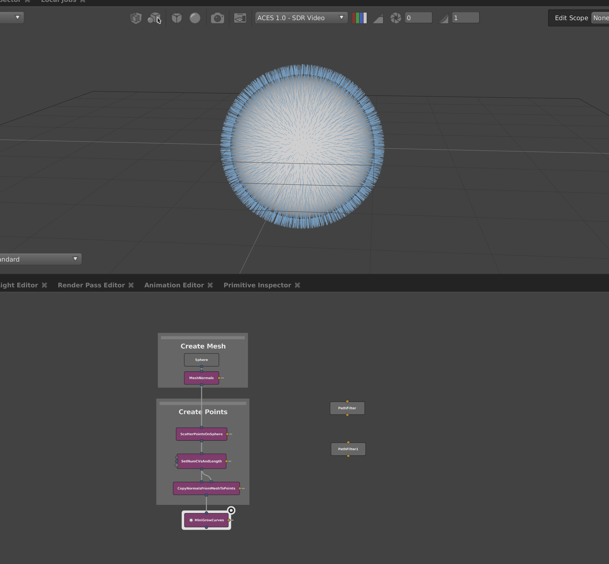

# Grow Curves

For each point in the input primitive generate a curve. The number of CVs per curve and length are defined vertex PrimVars on the input primitive.

### Required Input PrimVars

| Name        | Type  | Interpolation | Notes                            |
|-------------|-------|---------------|----------------------------------|
| N           | V3f   | Vertex        | Direction to grow the curve      |
| NumCVs      | int   | Vertex        | Number of control points to grow |
| CurveLength | float | Vertex        | Length of the curve to grow      |

{: .note-title }
> Grow Curves Example Scene
>
> Help > Examples > MiniGaffer > Grow Curves Example
>

